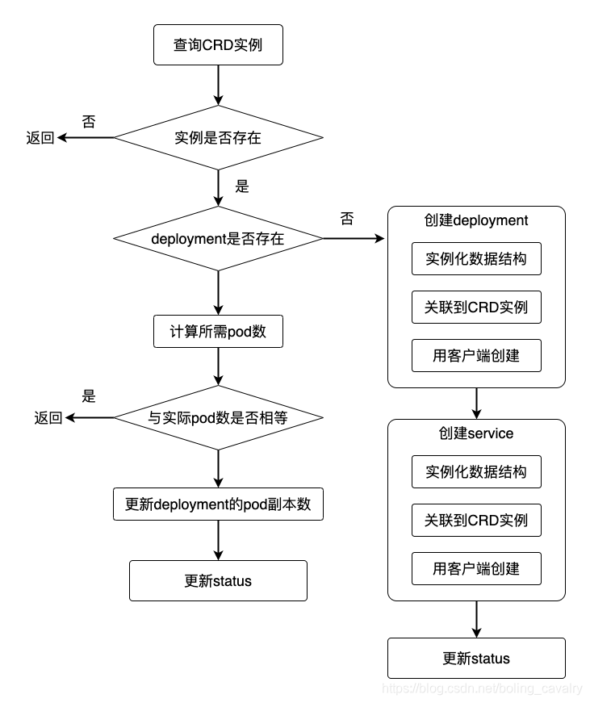

## 项目描述 
一个operator 根据qps 调整 webserver 副本的 例子

## 需求
elasticweb在kubernetes创建pod，至于pod数量是自动算出来的，要确保能满足QPS要求，以前面的情况为例，需要两个pod才能满足800的QPS；

## crd 设计
image：业务服务对应的镜像
port：service占用的宿主机端口，外部请求通过此端口访问pod的服务
singlePodQPS：单个pod的QPS上限
totalQPS：当前整个业务的总QPS

## 业务核心逻辑

## 快速开始 
1. 安装kubebuilder 和 golang。kubebuilder 
    参考 https://book.kubebuilder.io/quick-start.html
2. 初始化project：
    mkdir operator-example && cd operator-example && go mod init operator-example
3. 创建api：
    kubebuilder create api \
    --group operator-example \
    --version v1 \
    --kind ElasticWeb
4. 调整elasticweb struct
5. 部署crd 到kubernetes:
        make install
    查看crd 是否创建:
        kubectl get crd -A|grep elasticweb
6. 添加reconcile 逻辑
7. 在本机调试operator
8. 制作镜像，部署operator

### Prerequisites
- go version v1.20.0+
- docker version 17.03+.
- kubectl version v1.11.3+.
- Access to a Kubernetes v1.11.3+ cluster.
