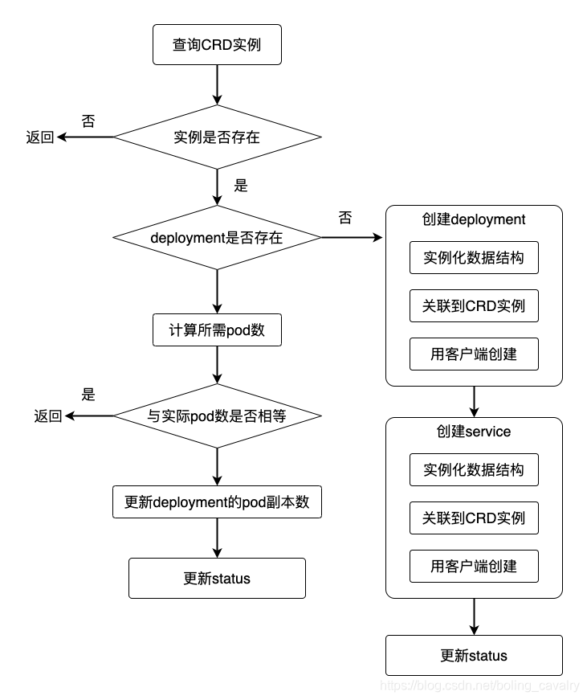

## Description
一个operator 例子

## Getting Started
1. 安装kubebuilder 和 golang。kubebuilder 
    参考 https://book.kubebuilder.io/quick-start.html
2. 初始化project：
    mkdir operator-example && cd operator-example && go mod init operator-example
3. 创建api：
    kubebuilder create api \
    --group operator-example \
    --version v1 \
    --kind ElasticWeb
4. 调整elasticweb struct
5. 部署crd 到kubernetes:
        make install
    查看crd 是否创建:
        kubectl get crd -A|grep elasticweb
6. 业务核心逻辑
    
    
7. 添加reconcile 逻辑
8. 在本机调试operator
9. 制作镜像，部署operator

### Prerequisites
- go version v1.20.0+
- docker version 17.03+.
- kubectl version v1.11.3+.
- Access to a Kubernetes v1.11.3+ cluster.
